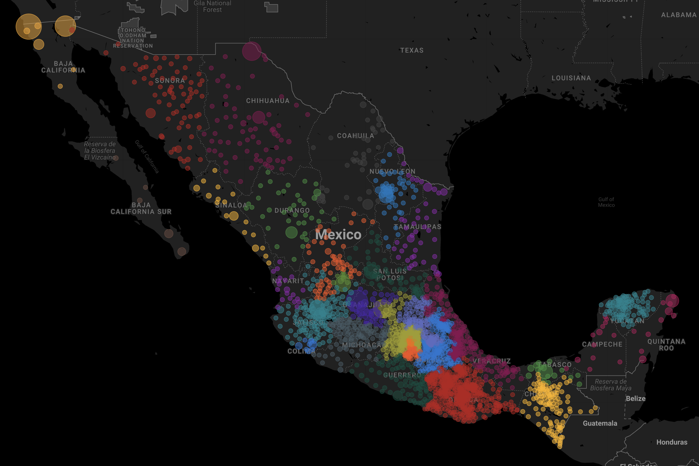
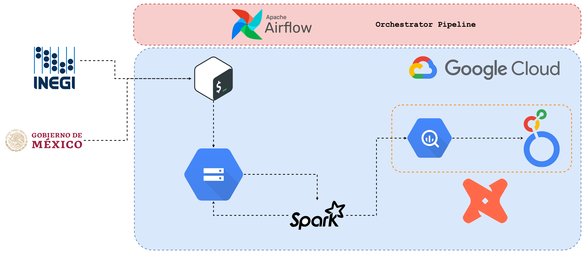
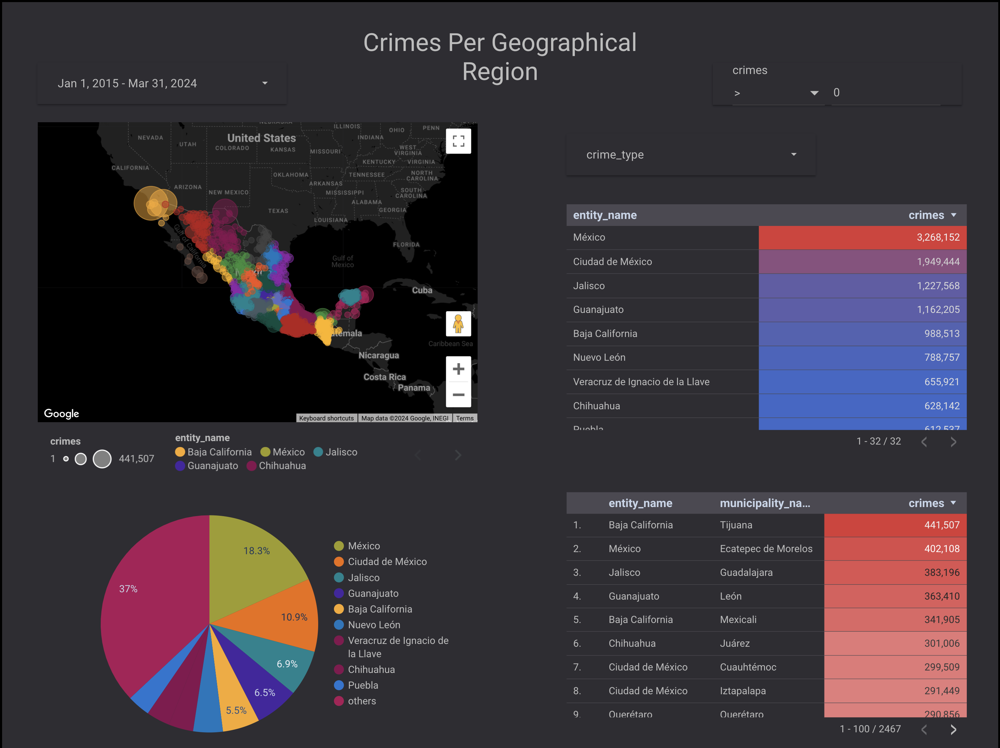

# Criminal Stats Dashboard for Mexico 🚔📊

Welcome to my project's README! This is where you get a sneak peek into Mexico crime data. 🦸‍♂️🇲🇽

    
</>

## What's This All About? 🤔

The goal? Simple. We're building a dashboard to showcase criminal stats in Mexico. It's a blend of cool tech, data magic, and a sprinkle of detective work. 🔍💻

## Tech Stack 🛠️

- **Google Cloud Platform (GCP):**
  - Dataproc: Sparkin' up those data jobs.
  - Google Cloud Storage: Where our data calls home.
  - BigQuery: Our data warehouse chill spot.
  - Compute Engine: Hosting a VM for our shenanigans.

- **Apache Airflow:** The conductor orchestrating our data symphony.

- **DBT (Data Build Tool):** Crafting our data models with finesse. 🔨

- **Docker:** Wrapping Airflow, DBT, and friends in neat little containers. 🐳

- **Terraform:** Building castles in the cloud (GCP). 🏰

## How Does It All Fit Together? 🧩

Imagine a world where data flows like a river, getting processed, stored, and visualized seamlessly. That's our game plan! 🌊📈

## Getting Started 🚀

1. **Clone Me:**
   git clone https://github.com/emilianolel/dez-project-emi.git

2. **Get Things Ready:**
   cd repository
   # Set up your environment (you got this!).

3. **Hook Up GCP:**
   - Spin up a GCP project.
   - Flip those API switches (Dataproc, BigQuery, you know the drill).
   - Make some service accounts dance to your tune.

4. **Fire Up Terraform:**
   terraform init
   terraform apply

5. **Launch Airflow:**
   - Dockerize Airflow.
   - Blast off using Docker Compose or Kubernetes.

## Let's Roll! 🎲

1. **Start Airflow:**
   # Get those Airflow gears turning.

2. **Check Out the UI:**
   - Visit `http://localhost:8080`.
   - Dive into the DAGs and hit play!

3. **Explore the Dashboard:**
   - Access our crime-busting dashboard via the provided link.
   

## Wanna Join the Adventure? 🦸‍♀️

We're all about teamwork! If you're itching to hop on board, here's how:

1. Fork this repo.
2. Cook up your feature branch (`git checkout -b feature/YourFeature`).
3. Add your magic (`git commit -am 'Added awesome stuff'`).
4. Push it like you mean it (`git push origin feature/YourFeature`).
5. Open that sweet, sweet Pull Request.

## Legal Stuff 📜

This project is licensed under the [MIT License](LICENSE). Go ahead, have fun with it!

---

