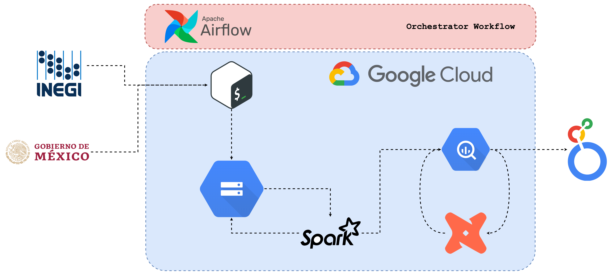

# Criminal Stats Dashboard for Mexico 🚔📊

Welcome to my project's README! This is where you get a sneak peek into Mexico crime data. 🦸‍♂️🇲🇽

    
</>

## What's This All About? 🤔

The goal? Simple. We're building a dashboard to showcase criminal stats in Mexico. It's a blend of cool tech, data magic, and a sprinkle of detective work. 🔍💻

## Tech Stack 🛠️

- **Google Cloud Platform (GCP):**
  - Dataproc: Sparkin' up those data jobs.
  - Google Cloud Storage: Where our data calls home.
  - BigQuery: Our data warehouse chill spot.
  - Compute Engine: Hosting a VM for our shenanigans.

- **Apache Airflow:** The conductor orchestrating our data symphony.

- **DBT (Data Build Tool):** Crafting our data models with finesse. 🔨

- **Docker:** Wrapping Airflow, DBT, and friends in neat little containers. 🐳

- **Terraform:** Building castles in the cloud (GCP). 🏰

## How Does It All Fit Together? 🧩

Imagine a world where data flows like a river, getting processed, stored, and visualized seamlessly. That's our game plan! 🌊📈

## Data Flow Overview 🌊

Our data journey is like riding a wave 🏄‍♂️—it starts with a splash and ends with a splashier insight! Here's the lowdown:

1. **Data Ingestion 🚀:**
   - Raw data rides in from all corners of Mexico, packing juicy details about crimes, locations, and times. Think of it as our data surfers catching the gnarliest waves of info.
   - We scoop up this data and stash it in our beachfront hangout: Google Cloud Storage (GCS). It's like the cool surf shack where all the rad data hangs out.

2. **Data Processing 🌊:**
   - Time to ride the wave! With Apache Airflow as our wave master, we shred through tasks like data cleanup, transformation, and enrichment. 🤙
   - Spark jobs on Google Dataproc clusters do the heavy lifting, turning raw data into polished pearls ready for analysis.

3. **Data Storage 🏄‍♀️:**
   - Our polished pearls make their way to the BigQuery beach house, where they chillax in structured tables. BigQuery is our go-to spot for sippin' on SQL queries and soaking up insights.
   - Sometimes, we stash intermediate goodies here too, for quick access during our surfing sessions.

4. **Data Modeling 💪:**
   - Now it's time to sculpt! With DBT (Data Build Tool), we mold our data into sleek, well-defined shapes. Think of it as giving our insights a killer beach bod.
   - SQL magic in DBT transforms our data, adding layers of meaning and depth, turning raw numbers into stories worth telling.

5. **Data Visualization 🌊:**
   - Hang on tight, 'cause here come the waves of insight! 🌊 We hop on LookerStudio visualization tool to craft custom dashboards to ride those data waves.
   - Interactive dashboards make it a breeze for everyone to catch a glimpse of the big kahuna: key metrics, trends, and patterns in Mexico's crime scene.

And that's how we roll—riding the data waves, catching insights, and turning them into action-packed adventures in the world of Mexican crime stats! 🔍

## Getting Started 🚀

1. **Clone Me:**
   git clone https://github.com/emilianolel/dez-project-emi.git

2. **Get Things Ready:**
   cd repository
   # Set up your environment (you got this!).

3. **Hook Up GCP:**
   - Spin up a GCP project.
   - Flip those API switches (Dataproc, BigQuery, you know the drill).
   - Make some service accounts dance to your tune.

4. **Fire Up Terraform:**
   terraform init
   terraform apply

5. **Launch Airflow:**
   - Dockerize Airflow.
   - Blast off using Docker Compose or Kubernetes.

## Let's Roll! 🎲

1. **Start Airflow:**
   # Get those Airflow gears turning.

2. **Check Out the UI:**
   - Visit `http://localhost:8080`.
   - Dive into the DAGs and hit play!

3. **Explore the Dashboard:**
   - Access our crime-busting dashboard via the provided link.
   

## Wanna Join the Adventure? 🦸‍♀️

We're all about teamwork! If you're itching to hop on board, here's how:

1. Fork this repo.
2. Cook up your feature branch (`git checkout -b feature/YourFeature`).
3. Add your magic (`git commit -am 'Added awesome stuff'`).
4. Push it like you mean it (`git push origin feature/YourFeature`).
5. Open that sweet, sweet Pull Request.

## Legal Stuff 📜

This project is licensed under the [MIT License](LICENSE). Go ahead, have fun with it!

---

