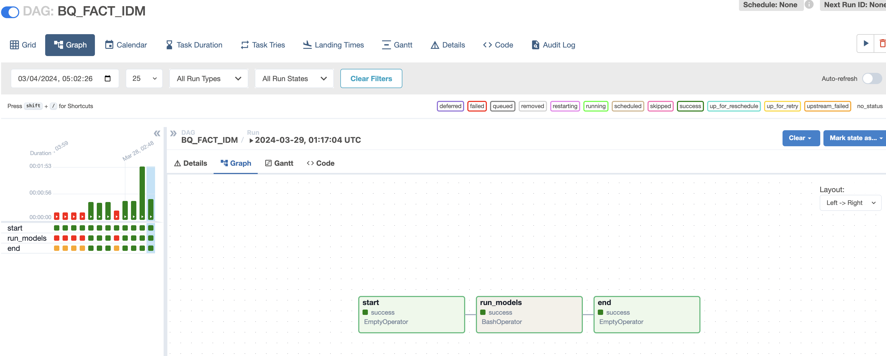

## Airflow DAGs: Enhancing Data Workflow Efficiency 🌬️

In our project, Airflow plays a pivotal role in orchestrating seamless data workflows, ensuring efficiency at every step. Let's delve into the key Airflow DAGs driving our data pipeline:

1. **Crime Data Ingestion DAG:**
   This DAG is dedicated to ingesting raw crime data from diverse sources and loading it into Google Cloud Storage (GCS) and subsequently into BigQuery. Through meticulous tasks orchestrated by Airflow, this DAG ensures the smooth flow of data from its sources to our data warehouse, laying the foundation for insightful analysis. Additionally, Spark jobs are executed within a Dataproc cluster to handle data processing tasks efficiently. 🚀🔍✨
   

2. **Geographical Data Ingestion DAG:**
   Similar to the Crime Data Ingestion DAG, this DAG focuses on ingesting geographical data relevant to our analysis. By collecting and processing geographical data, we enrich our dataset, enabling deeper insights into the spatial aspects of crime trends. The seamless integration of geographical data into our workflow is made possible by Airflow's task management capabilities. Spark jobs within a Dataproc cluster are utilized to process large volumes of data effectively. 🗺️🌐🛠️
   

3. **DBT Model Build DAG:**
   This DAG is responsible for executing a DBT (Data Build Tool) model, which operates atop BigQuery, our data warehouse. By running DBT transformations, this DAG refines raw data into structured insights, culminating in the creation of a Crime Fact table. Airflow orchestrates the execution of DBT tasks, ensuring timely and accurate model builds. 💼💡🔧
   

4. **Master DAG for Workflow Sequencing:**
   To optimize our data workflow, we've implemented a master DAG that orchestrates the execution sequence of critical tasks. This master DAG executes the Crime Data Ingestion DAG first, followed by the DBT Model Build DAG, contingent upon the successful execution of the preceding DAG. This meticulous sequencing, facilitated by Airflow, ensures data integrity and workflow efficiency. 🔄🛠️🚀
   

These Airflow DAGs serve as the backbone of our data pipeline, enabling the smooth flow of data from ingestion to insight generation. With Airflow's robust task scheduling and execution capabilities, we maintain agility and reliability in our data operations. 🌟💻🔗

