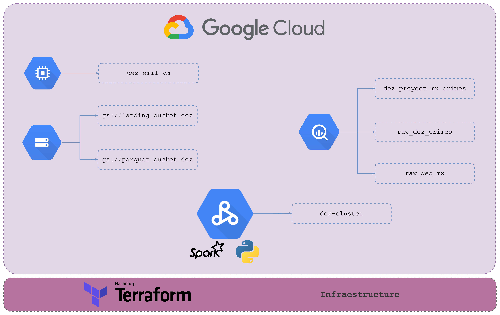

# Terraform Configuration for GCP Microservices

Welcome to the Terraform configuration for setting up GCP microservices for our data engineering project! Below, you'll find explanations for each of the GCP microservices we're using:

## Dataproc

Dataproc is Google Cloud's managed Spark and Hadoop service. It allows us to easily create clusters of virtual machines that are pre-installed with Spark and Hadoop, making it simple to run distributed data processing jobs. In our project, we use Dataproc to execute various data processing tasks, leveraging the power of Spark to analyze large volumes of data efficiently.

## Google Cloud Storage (GCS)

Google Cloud Storage is a highly scalable object storage service provided by Google Cloud. It serves as our primary storage solution for housing raw data, intermediate data, and any other artifacts generated throughout our data processing pipelines. GCS offers high durability, availability, and performance, making it ideal for storing diverse types of data used in our project.

## BigQuery

BigQuery is Google Cloud's fully managed, serverless data warehouse solution. It enables us to analyze large datasets quickly using SQL queries, without needing to manage infrastructure. In our project, BigQuery serves as our central repository for storing processed and transformed data, allowing us to perform complex analytics and generate insights using familiar SQL syntax.

## Compute Engine

Compute Engine provides virtual machines (VMs) on Google Cloud's infrastructure. It offers flexibility and control over VM instances, allowing us to customize hardware specifications, install software, and manage networking configurations. In our project, Compute Engine is utilized for hosting a VM instance to run various components of our data engineering workflows, such as orchestrators, web servers, or any other custom applications required.

## Terraform Configuration

The Terraform configuration in this repository automates the provisioning and configuration of the aforementioned GCP microservices. By defining infrastructure as code (IaC), we can easily spin up and manage our cloud resources in a repeatable and consistent manner. The Terraform scripts included here specify the desired state of our GCP environment, including resource definitions, configurations, and dependencies.

## Infrastructure Diagram

## Getting Started

To get started with deploying the GCP microservices using Terraform, follow these steps:

1. Install Terraform: Make sure you have Terraform installed on your local machine. You can download it from the official Terraform website: [Terraform Downloads](https://www.terraform.io/downloads.html).

2. Configure GCP Credentials: Ensure that you have set up authentication credentials for Terraform to interact with your GCP account. This typically involves creating a service account and providing it with appropriate roles and permissions. Refer to the Terraform documentation for detailed instructions on setting up GCP authentication: [Authentication - GCP Provider](https://registry.terraform.io/providers/hashicorp/google/latest/docs/guides/provider_reference#authentication).

3. Customize Terraform Variables: Modify the variables.tf file to customize the configuration according to your project requirements. You may need to adjust settings such as region, zone, machine types, storage buckets, etc., to match your specific use case.

4. Initialize Terraform: Run `terraform init` in the project directory to initialize Terraform and download any necessary plugins and modules.

5. Plan and Apply Changes: Use `terraform plan` to preview the changes Terraform will make to your infrastructure. Once satisfied, execute `terraform apply` to apply the changes and provision the GCP resources specified in the Terraform configuration.

6. Verify Deployment: After Terraform has finished applying the changes, verify that the GCP microservices are successfully deployed and functioning as expected. You can inspect the resources created in the GCP Console or use command-line tools like gcloud or gsutil to interact with them.

7. Cleanup (Optional): If you no longer need the deployed resources, you can use `terraform destroy` to tear down the infrastructure provisioned by Terraform and delete all associated GCP resources. Exercise caution when running this command, as it will permanently delete the specified resources.
